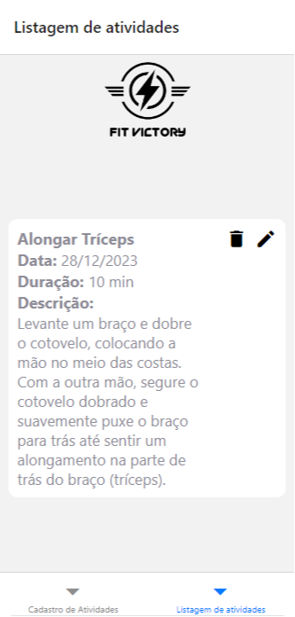
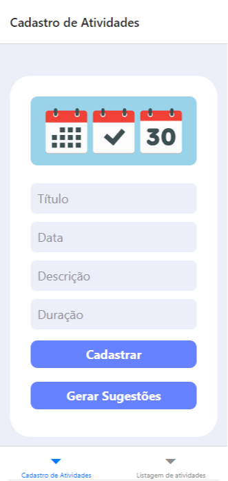

# fit-victory

<p>
  
  
</p>

## INTEGRANTES
- FELIPE BRENO
- LUCAS VINICIUS
- MARCUS DAGOSTINI
- THIAGO RIBEIRO

### commands
- npx create-react-native-app fit-victory-app
- npm install -g expo-cli
- npm install @react-native-async-storage/async-storage
- npm install @react-navigation/native
- npm install axios
- npm install @react-navigation/bottom-tabs
- npm install @react-navigation/stack react-native-reanimated react-native-gesture-handler react-native-screens react-native-safe-area-context @react-native-community/masked-view


OBS: API do firebase está com instabilidade do proprio google no dia de hoje 24/11/2023

### API1
- https://febrenos.pythonanywhere.com/bot
API para conversar com chat com integraçao a google places api, api de clima (ainda nao estamos utilizando essa api)


---

### API2

API de autenticação do usuário, deve ser rodada em java:
- intellij
- jdk 17
- gradle 7.6.1
- http://192.168.15.91:8080 Substitua pelo seu endereço IP local ipconfig

```js
//(POSTMAN)
//POST http://localhost:8080/login
{
  "login": "neurotrix@fiap.com",
  "password": "teste123"
}

//POST http://localhost:8080/register
{
    "nickname": "fe.brenos",
    "name": "fe",
    "email": "fe@fiap.com",
    "password": "teste123",
    "role": "USER"
}
```
---

### API3 (fire base, realtime dataBase)

https://fiap-2023-2tdst-default-rtdb.firebaseio.com
https://fitvictory-c924e-default-rtdb.firebaseio.com

```js
//SAVE
//items.json
{ "title", "date", "duration", "description" }

//GET
//items.json

//DELETE
//items/${id}.json

//UPDATE
//items/${id}.json
{ "title", "date", "duration", "description" }
```

